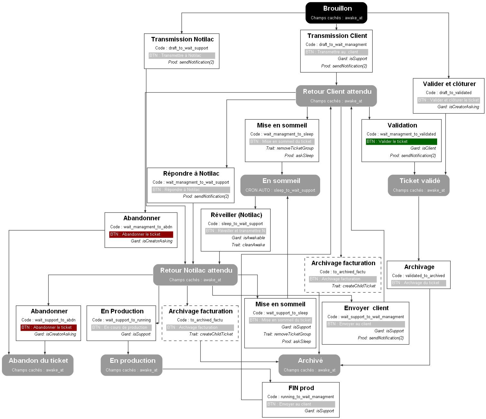

# Workflow : **ticket_w**
* type: **state_machine / single_state**
* Nom : ticket_w
* comentaire : 

## Representation graphique

## Liste des états
* **Brouillon** | code : draft
* **Retour support attendu** | code : wait_support
* **Retour client attendu** | code : wait_managment
* **En production** | code : running
* **Ticket validé** | code : validated
* **En sommeil** | code : sleep
* **Archivé** | code : archived
* **Abandon du ticket** | code : abdn

## Liste des transitions
* **Transmettre à Notilac** | code : draft_to_wait_support
    * Appliquer un jeux de contrôle : none
    * Liste des fonctions 
        *  sendNotification | type : prod  |  Arguments : waka.support::new_ticket, support  | description : Envoyer une notification
* **Transmettre au  client** | code : draft_to_wait_managment
    * Liste des fonctions 
        *  sendNotification | type : prod  |  Arguments : waka.support::new_ticket, client  | description : Envoyer une notification
        *  isSupport | type : gard  | description : Est dans l&#039;équipe support
* **Mettre en someil** | code : draft_to_sleep
    * Liste des fonctions 
        *  askSleep | type : prod  | description : Permet de préciser quant il faut réveiller la tâche
* **Abandonner le ticket** | code : draft_to_abdn
    * Liste des fonctions 
        *  isCreatorAsking | type : gard  | description : Est-ce le créateur de la tâche
* **Valider et clôturer le ticket** | code : draft_to_validated
    * Liste des fonctions 
        *  isCreatorAsking | type : gard  | description : Est-ce le créateur de la tâche
* **Envoyer au client** | code : wait_support_to_wait_managment
    * Liste des fonctions 
        *  sendNotification | type : prod  |  Arguments : waka.support::new_ticket, client  | description : Envoyer une notification
        *  isSupport | type : gard  | description : Est dans l&#039;équipe support
* **Mise en sommeil du ticket** | code : wait_support_to_sleep
    * Liste des fonctions 
        *  askSleep | type : prod  | description : Permet de préciser quant il faut réveiller la tâche
        *  isSupport | type : gard  | description : Est dans l&#039;équipe support
* **Abandonner le ticket** | code : wait_support_to_abdn
    * Liste des fonctions 
        *  isCreatorAsking | type : gard  | description : Est-ce le créateur de la tâche
* **En cours de production** | code : wait_support_to_running
    * Liste des fonctions 
        *  isSupport | type : gard  | description : Est dans l&#039;équipe support
* **FIN prod (retour client attendu)** | code : running_to_wait_managment
    * Liste des fonctions 
        *  isSupport | type : gard  | description : Est dans l&#039;équipe support
* **Répondre à Notilac** | code : wait_managment_to_wait_support
    * Liste des fonctions 
        *  sendNotification | type : prod  |  Arguments : waka.support::new_ticket, support  | description : Envoyer une notification
* **Valider le ticket** | code : wait_managment_to_validated
    * Liste des fonctions 
        *  sendNotification | type : prod  |  Arguments : waka.support::new_ticket, support  | description : Envoyer une notification
        *  isClient | type : gard  | description : Est dans l&#039;équipe client
* **Mise en sommeil du ticket** | code : wait_managment_to_sleep
    * Liste des fonctions 
        *  askSleep | type : prod  | description : Permet de préciser quant il faut réveiller la tâche
* **Abandonner le ticket** | code : wait_managment_to_abdn
    * Liste des fonctions 
        *  isCreatorAsking | type : gard  | description : Est-ce le créateur de la tâche
* **Réveiller + transmission Notilac** | code : sleep_to_wait_support
* **Réveiller + transmission client** | code : sleep_to_wait_managment
    * Liste des fonctions 
        *  isSupport | type : gard  | description : Est dans l&#039;équipe support
* **Réveiller et valider** | code : sleep_to_validated
* **Archivage du ticket** | code : validated_to_archived
* **Archivage facturation** | code : to_archived_factu
    * Liste des fonctions 
        *  createChildTicket | type : trait_onEnter  | description : Fonction qui va créer un ticket enfants

## Les jeux de permissions des champs
* default: 
* none: Aucune validation en dehors des règles du levier.
* factu: Le champ réveil et date de réveil doivent être remplis
